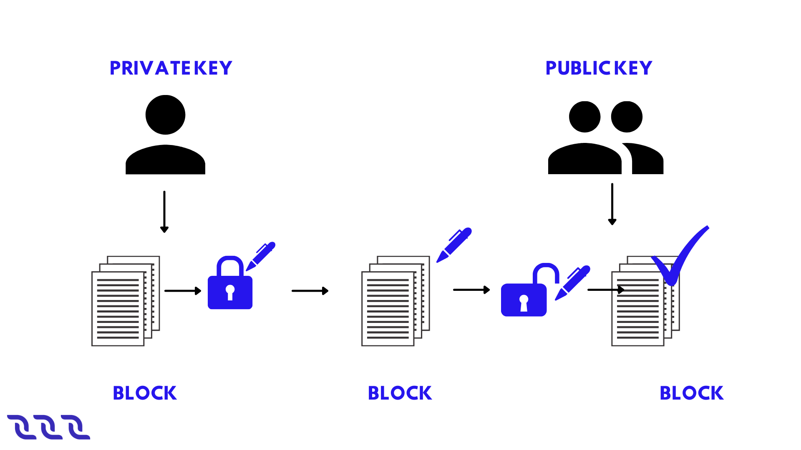
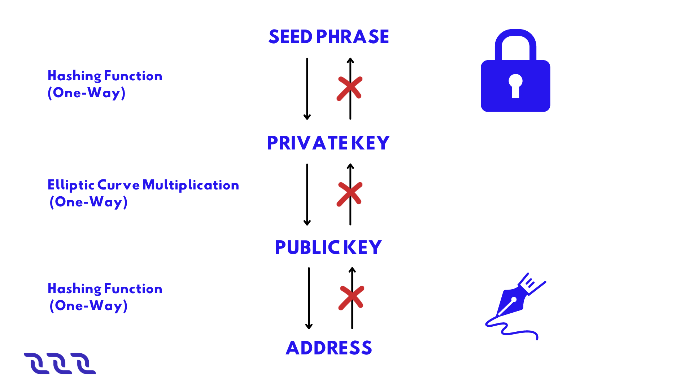
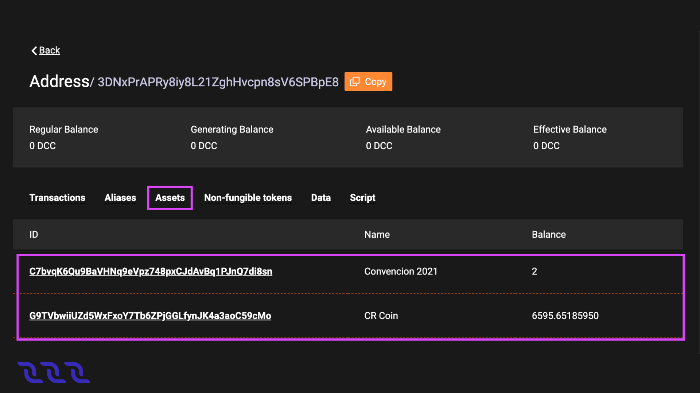
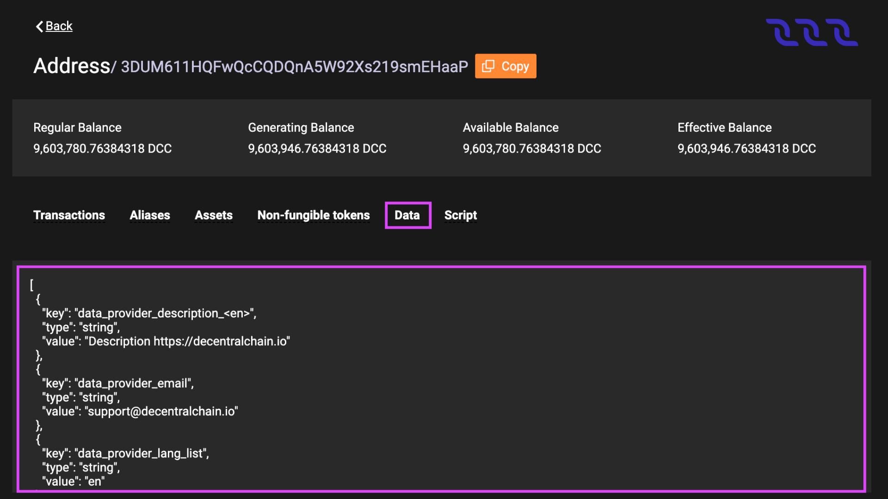

# Account

DecentralChain uses an account-based model. Each transaction is created on behalf of an account, all assets and data are associated with an account. An account has a pair of cryptographically bound keys: a private key that the account uses to sign transactions, and a public key that allows anyone to verify the signature. 

To create an account, store keys, and sign transactions, you can use **[Decentral.Exchange](http://decentral.exchange/)**.

## Account Keys

Unlike centralized applications, users do not have usernames and passwords on the blockchain. User identification and validation of their actions are performed using a cryptographically bound key pair:

* The private key is used to sign transactions or orders.
* The public key allows the verification of the digital signature.

Each transaction contains the public key of the sender’s account. The sender generates a digital signature of the transaction using the account’s private key. The signature and the sender’s public key are used to verify the authenticity of the transaction’s data and to check that the signature of the transaction matches the public key.

DecentralChain uses an asymmetric cryptographic system based on the elliptic curve Curve25519-ED25519 with X25519 keys. The guideline for generating keys and signatures is given in the **[cryptographic practical details](protocol#cryptographic-practical-details)** article. The private and public keys are  byte arrays. In UIs, the keys are displayed as base58 encoded strings. Base58-encoded keys can be of different lengths, the maximum length is  characters.

**Example private key in base58:** 6yCStrsBs4VgTmYcSgF37pmQhCo6t9LZk5bQqUyUNSAs

**Example public key in base58:** 5cqzmxsmFPBHm4tb7D8DMA7s5eutLXTDnnNMQKy2AYxh

## Secret (Seed) Phrase

The private key can be generated from some random seed phrase using hashing functions. The public key is obtained from the private key using an elliptic curve multiplication. The **[account address](account#address)** is obtained from the public key. All these transformations are unidirectional. The opposite direction is almost impossible in terms of the required computations.

The secret phrase (a.k.a. seed phrase, backup phrase) can be any combination of symbols, words, or bytes. DecentralChain wallet apps typically use a random set of 15 English words out of 2048 words available. Using such a phrase is secure since the probability of generating two identical seed phrases is $\frac{1}{2048^{15}}$ so brute-force will take millions of years on an average CPU. The point of using a secret phrase (rather than a private key) is to simplify user experience: the secret phrase is much easier to write down or remember.

**Example of a secret phrase:** body key praise enter toss road cup result shrimp bus blame typical sphere pottery claim

Security Information:

* The secret phrase or the private key derived from it provide complete control over the account, including the ability to dispose of funds. Do not give your secret phrase or private key to anyone, and do not publish or send them.
* The secret phrase cannot be changed: another secret phrase (even one that differs by a single character) will generate a different key pair, and therefore a different account.
* If you lose your secret phrase or private key, you will no longer be able to access your account ever again. We strongly encourage you to **[backup your secret phrase](account#backup-seed-phrase)**.
* If the secret phrase is compromised (you have accidentally sent it to someone or suspect that it was taken by fraudsters), immediately create a new account and transfer all the assets to it.

For ways to generate account keys, see the **[creating an account](account#account#creating-an-account)** article. 

## Creating an Account

To create an account means to generate an **[account key pair](account#account-keys)** and **[address](account#address)** based on a **[secret (seed) phrase](account#secret-seed-phrase)**. You can use **[Decentral.Exchange](http://decentral.exchange/)** online to create an account.

* On the main screen click Create Account then in the Create Password box type in the password, type it again in the Confirm Password box, accept the Terms and Conditions as well as the Privacy Policy and click Continue.
* On the next screen select Create Account and then choose the avatar you like the most for your account and click Continue.
* After that, select the name you want the account to have on that particular device and click Continue.
* At this point you will be forwarded to your wallet page. You must do a **[backup of your secret phrase](account#backup-seed-phrase)**.

## Backup Seed Phrase

* Open **[Decentral.Exchange](http://decentral.exchange/)** main screen and make sure you are logged into your account. Click on the account avatar and navigate to Settings > Security.
* Click Show in the Backup Phrase box.
* Write down the phrase and store it in a secure location.

Do not store the backup phrase unencrypted on any electronic device. We strongly recommend backing up the seed phrase, since this is the only way to restore access to your account in case of loss or theft of the device.

## Log in to Account

* Open **[Decentral.Exchange](http://decentral.exchange/)** main screen and click Create Account then in the Create Password box type in the password, type it again in the Confirm Password box, accept the Terms and Conditions as well as the Privacy Policy and click Continue.
* On the next screen select Import Accounts, then choose the Seed or Key option.
* After that type in the seed you backed up in the past and click Continue, then select the name you want the account to have on that particular device and click Continue.
* At this point you will be forwarded to your wallet page.

## Forgot Password

* Open **[Decentral.Exchange](http://decentral.exchange/)** main screen and click Forgot Password then select the Reset All option.
* On the next screen, in the Create Password box type in the password, type it again in the Confirm Password box, accept the Terms and Conditions as well as the Privacy Policy and click Continue.
* When this is done, select Import Accounts, then choose the Seed or Key option.
* After that type in the seed you backed up in the past and click Continue, then select the name you want the account to have on that particular device and click Continue.
* At this point you will be forwarded to your wallet page.

## Address

Address is an account attribute derived from the public key. The address also contains the chain ID that identifies the blockchain network, therefore the address on the Mainnet cannot be used on the Testnet and vice versa.

The address is a 26 byte array (see the address binary format). In UIs the address is displayed as a base58 encoded string like this one: 3PDfnPknnYrg2k2HMvkNLDb3Y1tDTtEnp9X.

Normally, the address starting with 3P refers to the Mainnet, and the address starting with 3M or 3N refers to Testnet or Stagenet.

The address is used to obtain information about the account:

* **[Token balances](account#account-balance)**,
* Entries of **[account data storage](account#account-data-storage)**,
* **[Aliases](account#alias)**,
* **[Assigned script](account#dapp-and-smart-account)**, etc.

The address is indicated:

* In **[transfer](transaction#transfer-transaction)**, **[mass transfer](transaction#mass-transfer-transaction)** and **[lease transactions](transaction#lease-transaction)** to identify a recipient;
* In **[invoke script transactions](transaction#invoke-script-transaction)** to identify an invoked dApp.

## Get Personal Address

* Open **[Decentral.Exchange](http://decentral.exchange/)** main screen and make sure you are logged into your account. Click on the account avatar and navigate to Address.
* Copy the address and use it, or you can also use the generated QR code.

## Alias

Alias is a short, easy to remember, name of the address. The alias is unique on the blockchain. One address can have several aliases. The alias can be used instead of the address:

* In **[transfer](transaction#transfer-transaction)**, **[mass transfer](transaction#mass-transfer-transaction)** and **[lease transactions](transaction#lease-transaction)** to identify a recipient; as well as in **[invoke script transactions](transaction#invoke-script-transaction)** to identify an invoked dApp.
* To find an account in **[DecentralChain Explorer](http://decentralscan.com/)**.

The alias cannot be deleted.

### Alias Requirements

The length of an alias can be from 4 to 30 bytes (1 character can take up to 4 bytes). The following characters are allowed:

* lowercase Latin letters
* numbers
* dot
* underscore
* hyphen
* @

### Create Alias

You can use **[Decentral.Exchange](http://decentral.exchange/)** online to create an alias.

* Make sure you are logged into your account. On the main screen click on the account avatar and navigate to Aliases.
* On the next screen select Create New and then type in the name of the alias and click Create New again to complete the process.

### View Aliases

The list of account aliases, as well as other blockchain data, is public and can be read by anyone. For example, you can see aliases in **[DecentralChain Explorer](http://decentralscan.com/)**. To do this, find an account by its **[address](account#address)** and switch to the Aliases tab.

Using Node REST API, you can obtain a list of aliases by address using the GET/alias/by-address/{address} method and an address by alias using the GET /alias/by-alias/{alias} method.

## Account Balance

Account balance is the amount of a **[token (asset)](token)** that belongs to the account.

One account can store different tokens in different amounts. For example, an account can have 50 **[DecentralCoins](token#decentralcoin)** and USD-N at the same time. The amount of the Y token on the account is called the account balance in Y token. If there is no Y token on the account, it is said that the account balance in Y token is equal to zero.

### Account Balance in DecentralCoin

There are four types of balances in DecentralChain:

* regular
* available
* effective
* generating

The regular balance is the amount of **[DecentralCoins](token#decentralcoin)** that belongs directly to the account. Thе other types of balances are determined counting **[leased](node#leased-proof-of-stake)** DecentralCoins.

Let us introduce the following notation:

* R is the regular balance,
* Lo is the amount of DecentralCoins which the account leased to other accounts,
* Li is the amount of DecentralCoins which are leased to the account by other accounts.

Then:

* Available balance = R – Lo
* Effective balance = R – Lo + Li
* Generating balance is the minimum value of the effective balance during the last 1000 blocks.

The generating balance of a **[node](node)** account affects the ability to participate in block generation. To generate blocks, you need a generating balance of at least  DecentralCoins. The larger the generating balance, the greater the chance to add the next block is.

### View Account Balance

The balances of any account, as well as other blockchain data, are public and can be read by anyone.

For example, you can see the list of tokens and their amount on the account in **[DecentralChain Explorer](http://decentralscan.com/)**. To do this, find an account by its address or alias. Balances in **[DecentralCoins](token#decentralcoin)** are displayed right under the address, balances in other assets are at the Assets tab, and **[non-fungible tokens (NFT)](token#non-fungible-token)** are at the Non-fungible tokens tab.

### How to buy DecentralCoins

You can buy **[DecentralCoin](token#decentralcoin)** tokens at **[Decentral.Exchange](http://decentral.exchange/)**.

## Account Data Storage

Account data storage is a key-value storage associated with an **[account](account)**. The key of each entry is a unique string. The value is the data being stored, it’s store using one of the types:

* String
* Boolean
* Integral
* Array of bytes

The size of an account data storage is unlimited. For key and value size limitations, see the **[data transaction](transaction#data-transaction)** article.

### View Account Data

Data storage of any account, as well as other blockchain data, are public and can be read by anyone. For example, you can see data entries in **[DecentralChain Explorer](http://decentralscan.com/)**. To do this, find an account by its  **[address](account#address)** or **[alias](account#alias)**  and switch to the Data tab.

### Add, Modify, Delete Entries

The account owner can add, modify or delete entries of the account data storage via a **[data transaction](transaction#data-transaction)**.

A **[dApp script](account#dapp-and-smart-account)** can add, modify or delete entries in the dApp’s data storage as a result of an **[invoke script transactions](transaction#invoke-script-transaction)** via script actions:

* **[BinaryEntry](../ride-language/structures#binaryentry)**
* **[BooleanEntry](../ride-language/structures#booleanentry)**
* **[IntegerEntry](../ride-language/structures#integerentry)**
* **[StringEntry](../ride-language/structures#deleteentry)**
* **[DeleteEntry](../ride-language/structures#binaryentry)**

## dApp and Smart Account

An account with a script assigned to it becomes a dApp or smart account. dApp is the account with the **[dApp script](../ride-language/script-types#dapp-script)** assigned. dApp is an application whose functions can be called from other accounts via an **[invoke script transactions](transaction#invoke-script-transaction)**. Callable functions can accept payments to the dApp and also perform actions applied to the blockchain:

* Add, modify or delete entries of the dApp account data storage.
* Transfer tokens from the dApp balance.
* Issue, reissue, burn tokens on behalf of the dApp, sponsorship setup.

Beyond that, a dApp script can comprise the verifier function that allows or denies transactions and orders that are sent on behalf of the dApp account depending on the specified conditions. The verifier function replaces the default verification that is used to verify the sender’s signature and allows you to set more complex rules, such as multisignature.

Using dApps, you can implement various blockchain-empowered applications: gaming and gambling, DeFi, digital identity, supply chains, and many others.

A smart account is an account with the  **[account script](../ride-language/script-types#account-script)** assigned. The account script is similar to a verifier function of a dApp script. Please note:

* To assign a script to an account, you have to send a **[set script transactions](transaction#set-script-transaction)** on behalf of the account.
* You can also change or delete the script via the set script transaction, unless the script itself prohibits it.
* The **[minimum fee](transaction#minimum-fee)** for any transaction sent from a dApp or smart account is increased by  DecentralCoins if the complexity of sender’s account script or dApp script verifier function exceeds the **[sender complexity threshold](../ride-language/dapp-to-app-invocation#script-complexity)**